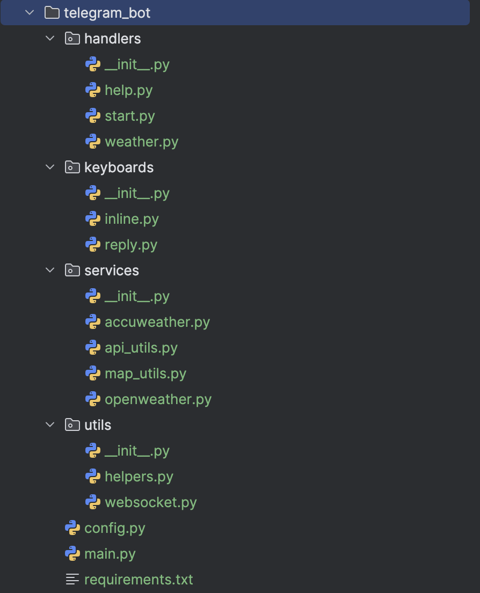
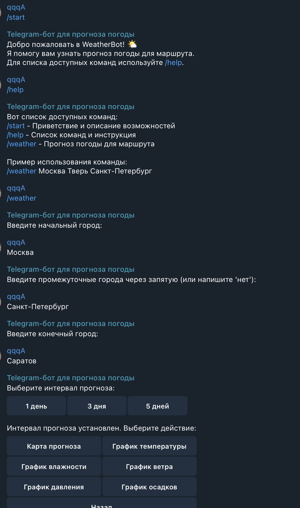
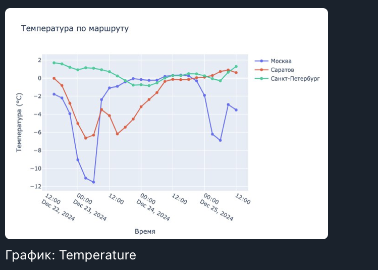
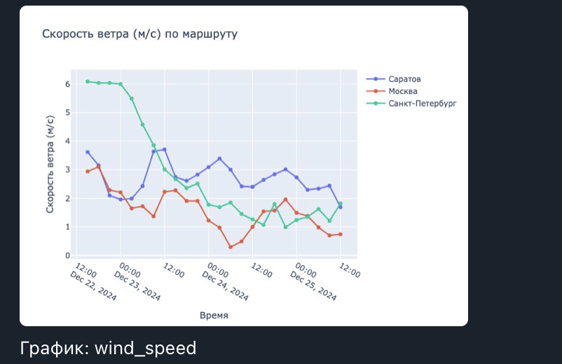
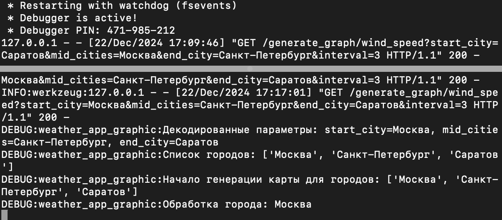
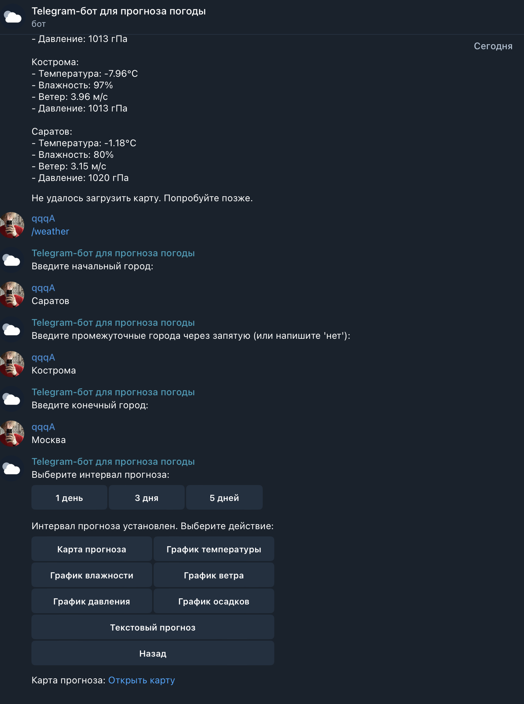
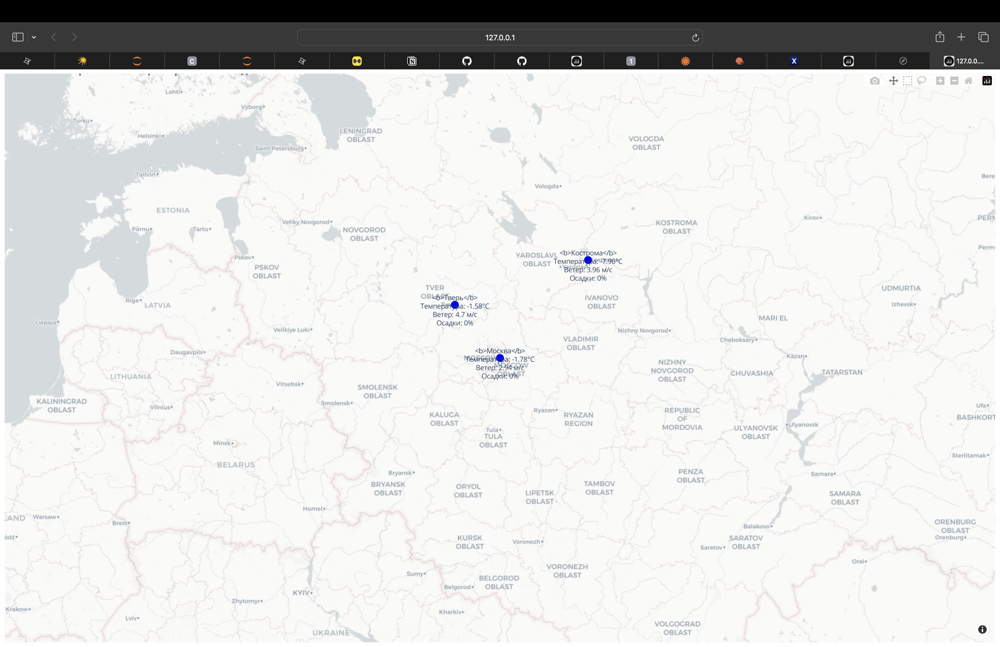
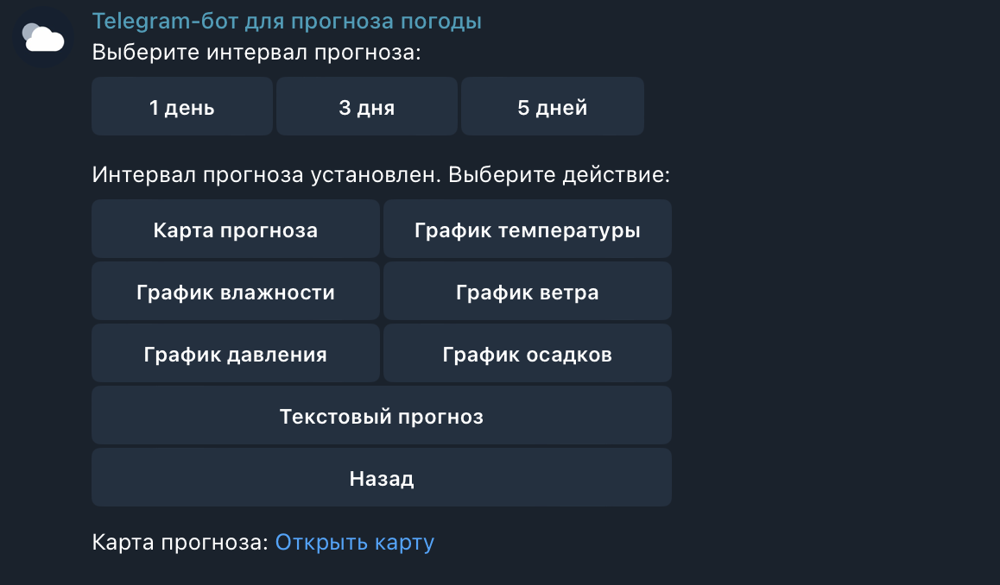

# README

## WeatherBot: Прогноз Погоды в Трёх Кликах

### Описание проекта

Привет! Это мой проект **WeatherBot**, который позволяет запрашивать прогноз погоды для нескольких городов по маршруту. Проект написан с использованием Python и работает через Telegram-бот. Я решил, что стандартных приложений погоды недостаточно: они скучные, а я хотел что-то с кнопками, графиками, и чтобы было весело пользоваться. Теперь вы можете узнать температуру, осадки и даже увидеть карту прогноза погоды на маршруте.


### Основные фичи
(ВНИМАНИЕ! ВСЕ АПИ ДЕАКТИВИРОВАНЫ И СТОЯТ В КАЧЕСТВЕ ПРИМЕРА!)

- **Бот в Telegram**:
  - /start — приветствие и описание возможностей.
  - /help — краткая инструкция по использованию.
  - /weather — прогноз погоды для маршрута. 
    - Можно добавить начальный, конечный и промежуточные города.
    - Выбор: текстовый прогноз, графики, либо карта.

- **Интеграция с OpenWeather API**:
  - Полный доступ к прогнозу на 1, 3 или 5 дней.
  - Параметры: температура, скорость ветра, давление, влажность, вероятность осадков.

- **Графики на Plotly**:
  - Интервалы до 5 дней.
  - Разные типы данных: температура, влажность, давление и т.д.

- **Карта с прогнозом**:
  - Генерируется через Plotly Mapbox.
  - Асинхронная обработка запросов для ускорения (карта теперь готова до того, как вы подумаете, зачем она вам).

### Почему Flask?

Изначально я пытался реализовать всё через Dash, но после нескольких бессонных ночей понял, что удобство Flask перевешивает Dash на всех фронтах. Flask не только проще в настройке, но и гораздо лучше подходит для обработки асинхронных задач (что важно для работы с картами).

Теперь веб-сервис на Flask:
- Поддерживает все типы графиков.
- Умеет обрабатывать маршруты с несколькими городами.
- Создаёт и сохраняет интерактивные карты с прогнозом погоды.

### Код: Веб-сервис

Пример асинхронной функции для получения данных о погоде:
```python
async def fetch_weather(session, city):
    city_encoded = quote(city)
    url = f"{BASE_URL}?q={city_encoded}&appid={API_KEY}&units=metric&lang=ru"
    try:
        async with session.get(url) as response:
            if response.status == 200:
                return await response.json()
            else:
                app.logger.error(f"Ошибка при запросе API для города {city}: {response.status}")
                return None
    except Exception as e:
        app.logger.error(f"Ошибка сети при запросе для города {city}: {e}")
        return None
```

Функция для создания карты:
```python
async def create_interactive_map_with_weather(cities):
    latitudes = []
    longitudes = []
    annotations = []

    weather_data_list = await fetch_all_weather(cities)
    coordinates_list = await fetch_all_coordinates(cities)

    for city, weather_data, coords in zip(cities, weather_data_list, coordinates_list):
        if not weather_data or not coords or coords == (None, None):
            continue

        lat, lon = coords
        temperature = weather_data["list"][0]["main"]["temp"]
        latitudes.append(lat)
        longitudes.append(lon)
        annotations.append(
            f"<b>{city}</b><br>Температура: {temperature}°C"
        )

    fig = go.Figure()
    fig.add_trace(go.Scattermapbox(
        lat=latitudes,
        lon=longitudes,
        mode="markers+text",
        marker=go.scattermapbox.Marker(size=14, color="blue"),
        text=annotations,
        textposition="top center",
        hoverinfo="text"
    ))
    return fig
```
## Небольшие подробности

### 1. Структура проекта



---

### 2. Начальный диалог с ботом



---

### 3. График температуры

График температуры для маршрута Москва — Саратов — Санкт-Петербург на 3 дня:



---

### 4. График ветра




---

### 5. Логи обработки карты

Пример логов обработки карты в консоли:



---

### 6. JSON-ответ карты

JSON-ответ для маршрута Москва — Тверь — Владимир:


---

### 7. Кнопки выбора интервалов и функций



---

### 8. Интерактивная карта

Интерактивная карта маршрута Кострома — Москва — Тверь:  
Файл карты сохраняется в: `telegram_bot/web_server_2/interactive_map.html`



---

### 9. Отправка карты ботом



---

## Технические сложности

**Обработка кириллицы:**
- Использование `quote_plus` и `unquote_plus` для кодирования и декодирования параметров URL.
- Логирование ошибок, связанных с кодировкой (`latin-1 codec issues`).

**Асинхронная обработка запросов:**
- Использование `aiohttp` для получения данных о погоде и координатах.
- Асинхронная генерация карты с прогнозами.

---


### Используемые технологии

- **Python**: сердце проекта.
- **Aiogram**: для управления ботом в Telegram.
- **Flask**: веб-сервер, заменивший Dash.
- **Plotly**: графики и карта.
- **Aiohttp**: для асинхронных запросов.

### Установка и запуск

1. Клонируйте репозиторий:
   ```
   git clone https://github.com/qwertyEg/telegram_bot_weather
   ```
2. Установите зависимости:
   ```
   pip install -r requirements.txt
   ```
3. Запустите веб-сервис:
   ```
   ./web_server_2/weather_app_graphic.py
   python weather_app_graphic.py
   ```
4. Запустите Telegram-бот:
   ```
   ./telegram_bot/main.py
   python main.py
   ```

---

Что лучше кодить 1000 строк кода для прогноза погоды или быть квадробером?

## Контакты

Если у вас есть вопросы или предложения по проекту, вы можете связаться со мной:

- **Telegram**: [zezezete](https://t.me/zezezete)
- **Почта**: [awfullth@gmail.com](mailto:awfullth@gmail.com)
- **Фото профиля**:  
  
