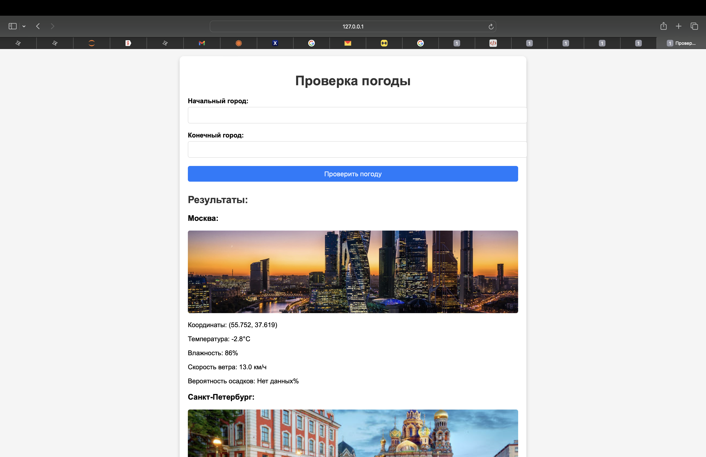

# Проверка погодных условий

### Описание проекта
Веб-приложение на Flask для получения данных о погоде между двумя городами. Реализован ввод через HTML-форму с обработкой ошибок.

---

### Обработанные ошибки
1. **Ошибка подключения к API:**
   - Причина: Проблемы с сетью или API.
   - Решение: Отображение сообщения об ошибке.

2. **Город не найден:**
   - Причина: Введено некорректное название города.
   - Решение: Вывод понятного сообщения "Город не найден".

3. **Отсутствие данных о погоде:**
   - Причина: Погода для заданных координат недоступна.
   - Решение: Сообщение "Данные о погоде отсутствуют".

4. **Пустые поля формы:**
   - Решение: Сообщение "Не указаны начальный или конечный города".

---

### Тестирование
1. Запуск сервера: `weather_app.py`.
2. Ввод различных данных:
   - Корректные города.
   - Неверные города.
   - Пустые поля.
3. Проверка работы обработки ошибок и вывода сообщений.