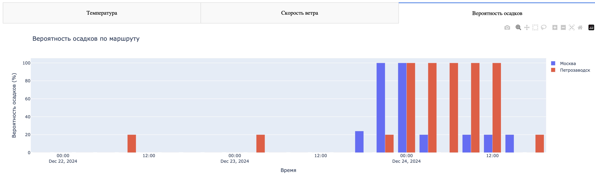

---

# Визуализация для веб-сервиса с прогнозом погоды для заданного маршрута

## Описание проекта
Этот проект представляет собой интерактивный веб-сервис для визуализации погодных данных, полученных с помощью API OpenWeather. Используются библиотеки Dash и Plotly для создания графиков и отображения данных.

---

## Почему OpenWeather?
Я использую API OpenWeather вместо AccuWeather по следующим причинам:
1. **Стабильность**: AccuWeather часто не предоставлял данные из-за ошибок при обработке запросов.
2. **Ограничения на запросы**: Бесплатный тариф AccuWeather имеет строгие ограничения, что затрудняло обработку данных для нескольких точек маршрута.
3. **Функциональность**: OpenWeather предоставляет широкий набор данных (осадки, влажность, давление), что позволило расширить возможности визуализации.

---

## Визуализация данных

### Карта маршрута
Интерактивная карта отображает актуальные погодные данные для всех точек маршрута. При наведении на город можно увидеть:
- Температуру
- Скорость ветра
- Вероятность осадков

**Пример карты маршрута:**


---

### Графики

#### Температура
**Линейный график** показывает изменения температуры для каждого города на маршруте, что удобно для отслеживания динамики прогноза.

**Пример графика температуры:**


#### Скорость ветра
**Столбчатая диаграмма** используется для визуализации скорости ветра. Это позволяет четко увидеть различия между временными интервалами.

**Пример графика ветра:**
)

#### Осадки
Я выбрал **столбчатую диаграмму** для отображения вероятности осадков, так как она:
1. Четко показывает различия между временными интервалами.
2. Легко воспринимается визуально.
3. Удобна для сравнения между несколькими городами.

**Пример графика осадков:**


#### Влажность
**Линейный график** отображает изменения влажности в процентах для каждого города маршрута. Такой формат помогает увидеть колебания уровня влажности.

#### Давление
**Линейный график** показывает изменения давления в гПа. Легко отслеживать резкие изменения, связанные с погодными фронтами.

---

### Таблица данных
Таблица предоставляет полный набор информации о погоде для всех точек маршрута, включая:
- Город
- Время прогноза
- Температуру
- Скорость ветра
- Вероятность осадков
- Влажность
- Давление

**Пример таблицы данных:**


---

## Неудачный эксперимент

На этапе разработки я пытался реализовать интеграцию с AccuWeather API и добавить изображения городов, используя следующие API:
- **Google Custom Search API**: выдавал изображения низкого качества.
- **Unsplash API**: иногда предлагал нерелевантные изображения.
- **Pexels API**: сталкивался с проблемами при наложении фона из-за каскадных стилей.

### Проблемы:
1. Изображения часто не соответствовали запросам.
2. Перекрытие каскадных стилей мешало корректному отображению.
3. Ограничения AccuWeather делали API непригодным для задачи.

**Пример бета-версии проекта:**


Из-за указанных сложностей от этой идеи пришлось отказаться.

---

## Как запустить проект
1. Установите зависимости из `requirements.txt`.
2. Запустите сервер:
   ```bash
   python app.py
   ```
3. Откройте приложение в браузере по адресу `http://127.0.0.1:8050`.

---

## Контакты
- **Telegram**: [@zezezete](https://t.me/zezezete)
- **Email**: [awfullth@gmail.com](mailto:awfullth@gmail.com)


---

